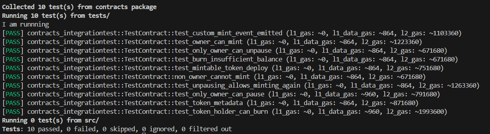

# 🪙 Mintable Token (Starknet - Cairo 1.0)

This project implements a fully functional **ERC20-compatible token** written in **Cairo 1.0**, built using the [Scaffold Stark](https://scaffoldstark.com/docs/quick-start/installation) template.

the contracts and tests are in snfoundry folder

### ✨ Features

- ✅ ERC20 Standard (name, symbol, decimals, totalSupply, transfer)
- ✅ Owner-only minting
- ✅ Token burning (by tokens owner)
- ✅ Pause & unpause (by owner)
- ✅ Custom `CustomMinted` event
- ✅ Full test suite with Foundry (snforge)

### ✨ Tests
The tests are inside snfoundry/contracts/tests/TestContract.cairo 

---
